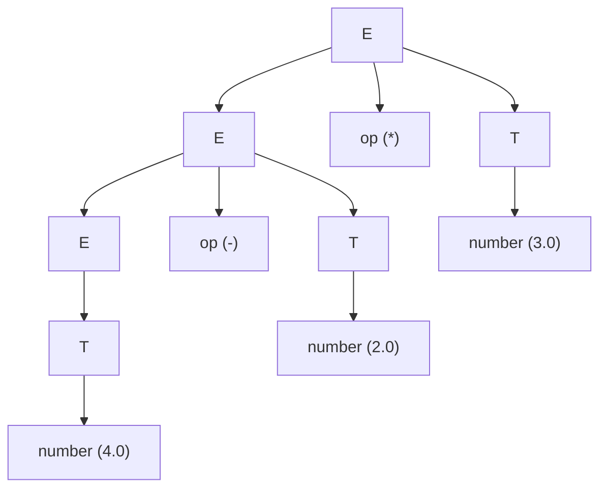
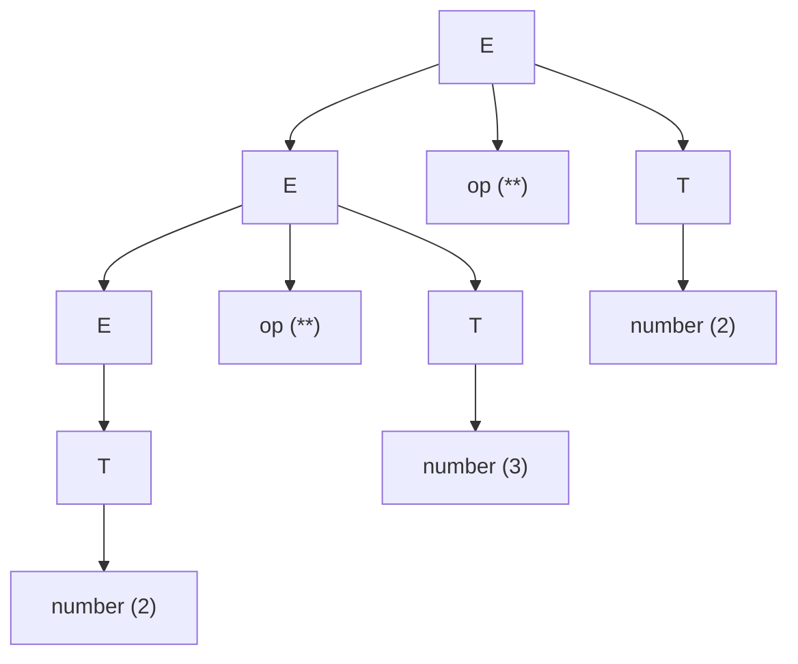

# Práctica de Laboratorio #5  
**Asignatura:** Procesadores de Lenguajes  
**Grado:** Ingeniería Informática  
**Curso:** 2025/2026  

---

# 1. Análisis de la gramática inicial

La práctica parte de una calculadora implementada con **Jison** mediante una **Syntax Directed Definition (SDD)**.

## Gramática original

```txt
L → E eof
E → E op T
E → T
T → number
```

## Reglas semánticas

```txt
L → E eof           L.value = E.value
E → E1 op T         E.value = operate(op.lexvalue, E1.value, T.value)
E → T               E.value = T.value
T → number          T.value = convert(number.lexvalue)
```

El token **op** representa los operadores:

```
+  -  *  /  **
```

Esta gramática **no respeta la precedencia**, evaluando **de izquierda a derecha**.

---

# 1.1 Derivaciones

## Expresión: `4.0 - 2.0 * 3.0`

```
L
→ E eof
→ E op T
→ E op T op T
→ T op T op T
→ number op number op number
→ 4.0 - 2.0 * 3.0
```

## Expresión: `2 ** 3 ** 2`

```
L
→ E eof
→ E op T
→ E op T op T
→ T op T op T
→ number op number op number
→ 2 ** 3 ** 2
```

## Expresión: `7 - 4 / 2`

```
L
→ E eof
→ E op T
→ E op T op T
→ T op T op T
→ number op number op number
→ 7 - 4 / 2
```

---

# 1.2 Árboles de análisis sintáctico

## 4.0 - 2.0 * 3.0



Interpretación según la gramática:

```
(4.0 - 2.0) * 3.0
= 6
```

---

## 2 ** 3 ** 2



Evaluación:

```
(2 ** 3) ** 2
= 8 ** 2
= 64
```

---

## 7 - 4 / 2


Evaluación:

```
(7 - 4) / 2
= 3 / 2
= 1.5
```

---

# 1.3 Orden de evaluación de acciones semánticas

Las acciones se ejecutan **de abajo hacia arriba (bottom-up)**.

## 4.0 - 2.0 * 3.0

```
convert(4.0)
convert(2.0)
operate('-',4,2)
convert(3.0)
operate('*',2,3)
```

Resultado:

```
6
```

---

## 2 ** 3 ** 2

```
convert(2)
convert(3)
operate('**',2,3)
convert(2)
operate('**',8,2)
```

Resultado:

```
64
```

---

## 7 - 4 / 2

```
convert(7)
convert(4)
operate('-',7,4)
convert(2)
operate('/',3,2)
```

Resultado:

```
1.5
```

---

# 1.4 Tests que fallan

Archivo:

```
__tests__/prec.test.js
```

```javascript
const parse = require('../src/index.js');

describe('Parser Failing Tests', () => {

    test('should handle multiplication and division before addition and subtraction', () => {
        expect(parse("2 + 3 * 4")).toBe(14);
        expect(parse("10 - 6 / 2")).toBe(7);
        expect(parse("5 * 2 + 3")).toBe(13);
        expect(parse("20 / 4 - 2")).toBe(3);
    });

    test('should handle exponentiation with highest precedence', () => {
        expect(parse("2 + 3 ** 2")).toBe(11);
        expect(parse("2 * 3 ** 2")).toBe(18);
        expect(parse("10 - 2 ** 3")).toBe(2);
    });

});
```

Estos tests fallan porque la gramática **no respeta precedencia**.

---

# 2. Nueva gramática con precedencia y asociatividad

Precedencia correcta:

```
1. **  (mayor precedencia, asociativo derecha)
2. * /
3. + -
```

Nueva gramática:

```
L → E eof
E → E opad T
E → T
T → T opmu R
T → R
R → F opow R
R → F
F → number
```

Reglas semánticas:

```
E → E1 opad T   E.value = operate(opad.lexvalue,E1.value,T.value)
T → T1 opmu R   T.value = operate(opmu.lexvalue,T1.value,R.value)
R → F opow R1   R.value = operate(opow.lexvalue,F.value,R1.value)
F → number      F.value = convert(number.lexvalue)
```

Tokens:

```
opad → + -
opmu → * /
opow → **
```

---

# 3. Tests con números flotantes

Archivo:

```
float.test.js
```

```javascript
describe('Float precedence tests', () => {

  test('should handle addition and multiplication with floats', () => {
    expect(parse("2.5 + 3.0 * 2")).toBe(8.5);
    expect(parse("1.5 + 2.5 * 2")).toBe(6.5);
  });

  test('should handle division precedence with floats', () => {
    expect(parse("10.0 - 4.0 / 2")).toBe(8);
    expect(parse("5.5 - 3.0 / 2")).toBe(4);
  });

  test('should handle multiplication and addition with floats', () => {
    expect(parse("2.5 * 2 + 3")).toBe(8);
    expect(parse("1.5 * 4 + 1")).toBe(7);
  });

  test('should handle exponentiation with floats', () => {
    expect(parse("2.0 ** 3")).toBe(8);
    expect(parse("4.0 ** 0.5")).toBe(2);
  });

  test('should handle exponentiation precedence with floats', () => {
    expect(parse("2.0 * 3.0 ** 2")).toBe(18);
    expect(parse("1.5 + 2.0 ** 3")).toBe(9.5);
  });

  test('should handle right associativity for exponentiation with floats', () => {
    expect(parse("2.0 ** 3.0 ** 2.0")).toBe(512);
  });
});
```

---

# 4. Soporte para paréntesis

Se añade la producción:

```
F → ( E )
```

Regla semántica:

```
F → ( E )   F.value = E.value
```

Esto permite expresiones como:

```
(2 + 3) * 4
```

---

# 5. Tests para paréntesis

Archivo:

```
parentheses.test.js
```

```javascript
describe('Parentheses tests', () => {

  test('should evaluate parentheses changing precedence', () => {
    expect(parse("(2 + 3) * 4")).toBe(20);     // (2+3)*4
    expect(parse("2 * (3 + 5)")).toBe(16);     // 2*(3+5)
    expect(parse("(10 - 6) / 2")).toBe(2);     // (10-6)/2
  });

  test('should handle nested parentheses', () => {
    expect(parse("(2 + (3 * 4))")).toBe(14);   // 2 + (3*4)
    expect(parse("((1 + 2) * (3 + 4))")).toBe(21); // (1+2)*(3+4)
  });

  test('should handle parentheses with exponentiation', () => {
    expect(parse("(2 ** 3) ** 2")).toBe(64);   // (2^3)^2 = 8^2
    expect(parse("2 ** (3 ** 2)")).toBe(512);  // 2^(3^2) = 2^9
  });

  test('should handle parentheses with floats', () => {
    expect(parse("(2.5 + 2.5) * 2")).toBe(10); // (2.5+2.5)*2
    expect(parse("4.0 ** (1.0 / 2.0)")).toBe(2); // 4^(0.5)=2
  });

  test('should ignore whitespace inside parentheses', () => {
    expect(parse(" (  2 + 3 ) * 4 ")).toBe(20);
  });
```

---

# Conclusión

Se ha modificado la gramática original para:

- Respetar la **precedencia de operadores**
- Implementar la **asociatividad correcta**
- Soportar **números flotantes**
- Permitir **expresiones con paréntesis**

Tras estas modificaciones, todos los tests pasan correctamente y el parser evalúa las expresiones según las reglas matemáticas estándar.